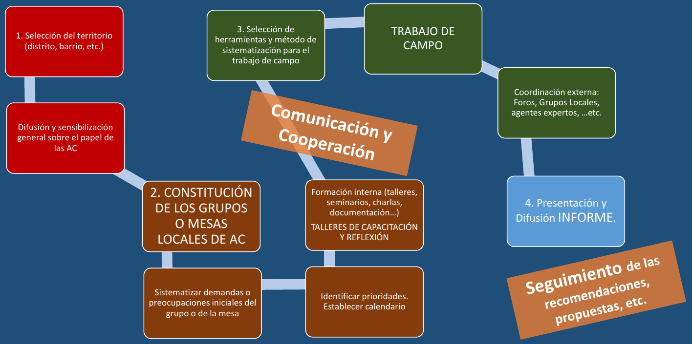
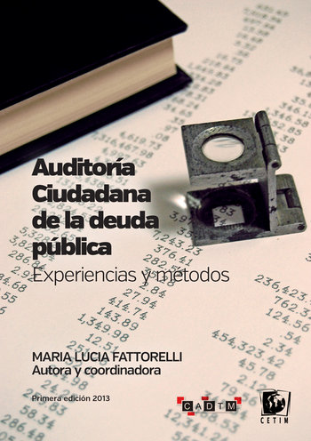
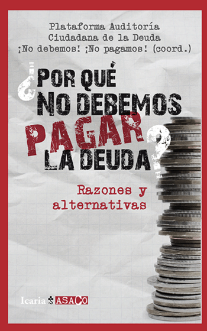
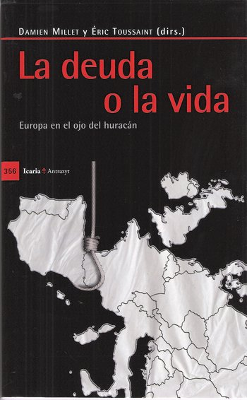

http://auditoriaciudadana.net  
[@AuditoriaMadrid](https://twitter.com/AuditoriaMadrid)

---

## Auditoría Ciudadana de los Distritos

---

## Metodología para los Distritos

<object type="image/svg+xml" data="img/esquema_auditoria_distritos.svg" style="height:700px">
</object>

----

### Metodología de las Mesas de Auditoría de los Foros Locales

---

## Creación del grupo promotor

El grupo promotor será el encargado de promover y dirigir la Auditoría Ciudadana en el distrito.

<table class='colortable' style='border-collapse: collapse; margin-top: 1em; margin-bottom: 1em;' >
<thead>
<tr>
<th style='border-bottom: 1px solid grey; border-top: 2px solid grey; text-align: center;'>Tareas</th>
<th style='border-bottom: 1px solid grey; border-top: 2px solid grey; text-align: center;'>Herramientas</th>
</tr>
</thead>
<tbody>
<tr>
<td style='text-align: left;'>Constituir el grupo promotor de la auditoría del distrito</td>
<td style='text-align: left;'>Crear correo electrónico Darse de alta en el <a href="https://madridauditamadrid.org" target="_blank">https://madridauditamadrid.org</a></td>
</tr>
<tr>
<td style='text-align: left;'>Establecer canales de comunicación</td>
<td style='text-align: left;'>Listas de correo ([Google Groups](https://groups.google.com))   Grupo de chat ([Telegram](https://telegram.org/))</td>
</tr>
<tr>
<td style='text-align: left;'>Establecer el calendario de reuniones</td>
<td style='text-align: left;'>Crear un calendario compartido ([Google Calendar](https://calendar.google.com))</td>
</tr>
<tr>
<td style='text-align: left;'>Establecer canales de difusión</td>
<td style='text-align: left;'>[Facebook](https://www.facebook.com/) y [Twitter](https://twitter.com/)</td>
</tr>
<tr>
<td style='border-bottom: 2px solid grey; text-align: left;'>Comunicar a la junta distrital el comienzo de la auditoría</td>
<td style='border-bottom: 2px solid grey; text-align: left;'>Correo de comunicación con la concejalía de distrito o con el Foro Local</td>
</tr>
</tbody>
</table>

---

## Formación

La formación debe acompañar todo el proceso.

No es necesario ser expertos en finanzas o leyes, pero si saber lo básico sobre:

- Auditorías Ciudadanas
- El concepto de Ilegitimidad
- Presupuestos Municipales
- Contratación Pública
- Transparencia
- Metodologías Participativas

----

### Formación sobre Auditorías Ciudadanas

- [Web de la Plataforma Auditoría Ciudadana de la Deuda](http://auditoriaciudadana.net/)
- [Guía para crear un grupo de Auditoría de la Deuda Municipal](doc/guia-grupos-auditoria-cast.pdf)
- [Descifra tu deuda: Guía de auditoría ciudadana municipal](http://auditoriaciudadanamunicipal.com/)  

- [Auditoría ciudadana de la deuda pública (Experiencias y médotos)](http://www.cadtm.org/IMG/pdf/Auditoria_imprenta-2_copy-2.pdf)  

----

### Formación sobre Ilegitimidad

- [El concepto de ilegimitad](http://pacd-madrid.github.io/concepto-ilegitimidad)
- [Por qué no debemos pagar la deuda](http://www.cadtm.org/Por-que-no-debemos-pagar-la-deuda)  

- [La deuda o la vida](http://www.cadtm.org/La-deuda-o-la-vida)  

----

### Formación sobre Presupuestos Municipales

- [Entendiendo un presupuesto municipal](doc/entendiendo-un-presupuesto-municipal.pdf)

----

### Formación sobre la Ley de Transparencia

- [La Ley de Transparencia](https://pacd-madrid.github.io/transparencia)

----

### Formación sobre Contratación Pública

- [La ley de Contratación Pública](https://pacd-madrid.github.io/contratacion-publica/#/)  
 

<iframe width="560" height="315" src="https://www.youtube.com/embed/Tfl3qr0yZF0" frameborder="0" allowfullscreen></iframe>

----

### Formación sobre Investigación Participativa

- [Investigación participativa aplicada a la auditoría](doc/investigacion-aplicada-auditoria.pdf)

---

## Definición de criterios de ilegitimidad

Los criterios de ilegitimidad orientarán la búsqueda de casos y en última instancia la declaración de gastos, ingresos o deuda ilegítimos. 
Deben definirse por el grupo promotor y someterse a debate por la población.

<table class='colortable' style='border-collapse: collapse; margin-top: 1em; margin-bottom: 1em;' >
<thead>
<tr>
<th style='border-bottom: 1px solid grey; border-top: 2px solid grey; text-align: center;'>Tareas</th>
<th style='border-bottom: 1px solid grey; border-top: 2px solid grey; text-align: center;'>Herramientas</th>
</tr>
</thead>
<tbody>
<tr>
<td style='text-align: left;'>Consensuar unos criterios mínimos de ilegitimidad</td>
<td style='text-align: left;'><a href="https://drive.google.com/file/d/0Bwg6TrKoFf05NkozZFJLLVptZ0U/view?usp=sharing">Definición de ilegitimidad de la PACD</a> <a href="https://drive.google.com/file/d/0B4kxDAyPr3w9SnBKcjFoZXdta2M/view">Conclusiones del I Encuentro ciudadano de la Auditoría del Ayuntamiento de Madrid</a></td>
</tr>
<tr>
<td style='border-bottom: 2px solid grey; text-align: left;'>Comunicar los criterios adoptados a la PACD</td>
<td style='border-bottom: 2px solid grey; text-align: left;'>Correo de la PACD <a href="mailto:madridauditamadrid@gmail.com" target="_blank">madridauditamadrid@gmail.com</a></td>
</tr>
</tbody>
</table>

---

## Identificación de casos de presuntas ilegitimidades

<table class='colortable' style='border-collapse: collapse; margin-top: 1em; margin-bottom: 1em;' >
<thead>
<tr>
<th style='border-bottom: 1px solid grey; border-top: 2px solid grey; text-align: center;'>Tareas</th>
<th style='border-bottom: 1px solid grey; border-top: 2px solid grey; text-align: center;'>Herramientas</th>
</tr>
</thead>
<tbody>
<tr>
<td style='text-align: left;'>Identificar los casos de presunta ilegitimidad en el distrito</td>
<td style='text-align: left;'>[Ficha de ilegitimidad de la PACD](https://docs.google.com/forms/d/e/1FAIpQLSfxm74mv1k-UCMeyPF13vWlyX19O02hbgMhvCWSDrof6FzZ4A/viewform) 
[Cuestionario de malas prácticas](doc/cuestionario-malas-practicas.pdf)</td>
</tr>
<tr>
<td style='text-align: left;'>Publicar los casos detectados</td>
<td style='text-align: left;'>Blog <a href="https://madridauditamadrid.org" target="_blank">https://madridauditamadrid.org</a></td>
</tr>
<tr>
<td style='border-bottom: 2px solid grey; text-align: left;'>Comunicar los casos detectados a la junta distrital y al Ayuntamiento</td>
<td style='border-bottom: 2px solid grey; text-align: left;'>Correos de comunicación con concejalía de distrito y el Ayuntamiento Correo de comunicación con el Foro Local.</td>
</tr>
</tbody>
</table>

---

## Selección de casos a auditar

Entre todos los casos de presuntas ilegitimidades detectados, el grupo promotor debe seleccionar aquellos que va a auditar.

<table class='colortable' style='border-collapse: collapse; margin-top: 1em; margin-bottom: 1em;' >
<thead>
<tr>
<th style='border-bottom: 1px solid grey; border-top: 2px solid grey; text-align: center;'>Tareas</th>
<th style='border-bottom: 1px solid grey; border-top: 2px solid grey; text-align: center;'>Herramientas</th>
</tr>
</thead>
<tbody>
<tr>
<td style='text-align: left;'>Seleccionar los casos a auditar</td>
<td style='text-align: left;'>Fichas de ilegitimidad de los casos identificados</td>
</tr>
<tr>
<td style='border-bottom: 2px solid grey; text-align: left;'>Publicar los casos seleccionados</td>
<td style='border-bottom: 2px solid grey; text-align: left;'>Blog <a href="https://madridauditamadrid.org" target="_blank">https://madridauditamadrid.org</a></td>
</tr>
</tbody>
</table>

----

### Criterios para la selección de casos

Se puede establecer una matriz con los siguientes criterios:

- Sencillez del caso (criterio más recomendable al principio).
- Magnitud del caso (por coste o por el número de personas a las que afecta).
- Información disponible.
- Mayor consenso de ilegitimidad en la población.
- Complejidad del caso y capacidad del grupo para abordarlo.
- Capacidad de sumar gente a la auditoría o a la movilización.
- Motivación personal o grupal.

----

### Recomendaciones

- Empezar por casos sencillos.
- Si los casos son pequeños, llevar varios en paralelo (agiliza la investigación al poder formular consultas simultaneas).
- Si el caso es grande buscar aliados en otros colectivos del distrito o en los grupos auditores de otros distritos.

---

## Análisis de casos

Es la parte más laboriosa de la auditoría.

<table class='colortable' style='border-collapse: collapse; margin-top: 1em; margin-bottom: 1em;' >
<thead>
<tr>
<th style='border-bottom: 1px solid grey; border-top: 2px solid grey; text-align: center;'>Tareas</th>
<th style='border-bottom: 1px solid grey; border-top: 2px solid grey; text-align: center;'>Herramientas</th>
</tr>
</thead>
<tbody>
<tr>
<td style='text-align: left;'>Realizar consultas sobre el caso</td>
<td style='text-align: left;'>[Portal de Transparencia](https://transparencia.madrid.es/portales/transparencia/es/Acceso-a-la-informacion?vgnextfmt=default&vgnextchannel=5e0a508929a56510VgnVCM1000008a4a900aRCRD) [Peticiones por registro municipal](https://sede.madrid.es/portal/site/tramites/menuitem.dd7c2859598d94d061e061e084f1a5a0/?vgnextoid=db32275e58889210VgnVCM100000171f5a0aRCRD&selectedChannel=true&target=RegistroElectronico) Filtraciones a través del blog <a href="https://madridauditamadrid.org" target="_blank">https://madridauditamadrid.org</a></td>
</tr>
<tr>
<td style='text-align: left;'>Registrar las consultas realizadas</td>
<td style='text-align: left;'>Registro de consultas del blog <a href="https://madridauditamadrid.org" target="_blank">https://madridauditamadrid.org</a></td>
</tr>
<tr>
<td style='text-align: left;'>Contrastar los indicios de ilegitimidad con la información obtenida</td>
<td style='text-align: left;'>Ficha de ilegitimidad del caso</td>
</tr>
<tr>
<td style='border-bottom: 2px solid grey; text-align: left;'>Publicación de hallazgos</td>
<td style='border-bottom: 2px solid grey; text-align: left;'>Blog <a href="https://madridauditamadrid.org" target="_blank">https://madridauditamadrid.org</a> Redes sociales y medios de comunicación</td>
</tr>
</tbody>
</table>

----

### Fuentes de información

- Administración Europea
    - [Diario Oficial de la UE](http://eur-lex.europa.eu/oj/direct-access.html?locale=es)
    - [Banco Central Europeo](https://www.ecb.europa.eu/ecb/html/index.es.html)
    - [Eurostat](http://ec.europa.eu/eurostat)

- Administración Central
    - [Portal de transparencia](http://transparencia.gob.es)
    - [Boletín oficial del Estado](https://www.boe.es/diario_boe/)
    - [Banco de España](http://www.bde.es/bde/es/)
    - [Instituto Nacional de Estadística](http://www.ine.es)
    - [Legislación](https://www.boe.es/legislacion/)
    - [Rendición de Cuentas](http://www.rendiciondecuentas.es)
    - [Contratación del Sector Público](https://contrataciondelestado.es)

----

- Administraciones Autonómicas
    - [Boletines Oficiales Autonómicos](https://www.boe.es/legislacion/enlaces/boletines_autonomicos.php)
    - [Sindicaturas de Cuentas Autonómicas](http://www.rendiciondecuentas.es/es/informaciongeneral/controlentidades/OrganosControlExterno.html)

- Administraciones Municipales
    - [Boletín oficial del Ayuntamiento de Madrid](https://goo.gl/dDk0jG)
    - [Perfil del contratante del Ayuntamiento de Madrid](https://goo.gl/vf4Oay)
    - [Normativa municipal del Ayuntamiento de Madrid](https://goo.gl/Inx8tZ)

- Otras fuentes
    - [Plataforma Auditoría Ciudadana de la Deuda](http://auditoriaciudadana.net/)
    - [Observatorios Ciudadanos Municipales](http://ocmunicipal.net/observatorios/)
    - [SIELOCAL Transparencia Económica](http://www.sielocal.com/)

---

## Elaboración del informe de auditoría del caso

El informe de auditoría del caso debe recopilar las principales pruebas para declarar el caso ilegítimo.

<table class='colortable' style='border-collapse: collapse; margin-top: 1em; margin-bottom: 1em;' >
<thead>
<tr>
<th style='border-bottom: 1px solid grey; border-top: 2px solid grey; text-align: center;'>Tareas</th>
<th style='border-bottom: 1px solid grey; border-top: 2px solid grey; text-align: center;'>Herramientas</th>
</tr>
</thead>
<tbody>
<tr>
<td style='text-align: left;'>Elaborar un informe de auditoría del caso</td>
<td style='text-align: left;'>[Plantilla de informe de auditoría la PACD](http://pacd-madrid.github.io/fichas-ilegitimidad/informes/Informe_Oficina_de_Atencion_al_Contribuyente_calle_Hierro.html)</td>
</tr>
<tr>
<td style='text-align: left;'>Enviar el informe al Ayuntamiento</td>
<td style='text-align: left;'>Correos de comunicación con concejalía de distrito y el Ayuntamiento. Correo del Foro local</td>
</tr>
<tr>
<td style='border-bottom: 2px solid grey; text-align: left;'>Publicar el informe de auditoría del caso</td>
<td style='border-bottom: 2px solid grey; text-align: left;'>Blog <a href="https://madridauditamadrid.org" target="_blank">https://madridauditamadrid.org</a> Redes sociales y medios de comunicación</td>
</tr>
</tbody>
</table>

---

## Elaboración del informe de auditoría del distrito

El informe final debe incluir los informes de todos los casos auditados en el distrito y las conclusiones de la auditoría.

<table class='colortable' style='border-collapse: collapse; margin-top: 1em; margin-bottom: 1em;' >
<thead>
<tr>
<th style='border-bottom: 1px solid grey; border-top: 2px solid grey; text-align: center;'>Tareas</th>
<th style='border-bottom: 1px solid grey; border-top: 2px solid grey; text-align: center;'>Herramientas</th>
</tr>
</thead>
<tbody>
<tr>
<td style='text-align: left;'>Elaborar un informe de auditoría del distrito</td>
<td style='text-align: left;'>Plantilla de informe de auditoría la PACD</td>
</tr>
<tr>
<td style='text-align: left;'>Enviar el informe al Ayuntamiento y presionar para el no pago de la deuda ilegítima</td>
<td style='text-align: left;'>Correos de comunicación con concejalía de distrito y el Ayuntamiento Correo del Foro local</td>
</tr>
<tr>
<td style='border-bottom: 2px solid grey; text-align: left;'>Publicar el informe de auditoría del distrito</td>
<td style='border-bottom: 2px solid grey; text-align: left;'>Blog <a href="https://madridauditamadrid.org" target="_blank">https://madridauditamadrid.org</a> Redes sociales y medios de comunicación</td>
</tr>
</tbody>
</table>

---

## Extensión a otros distritos

<table class='colortable' style='border-collapse: collapse; margin-top: 1em; margin-bottom: 1em;' >
<thead>
<tr>
<th style='border-bottom: 1px solid grey; border-top: 2px solid grey; text-align: center;'>Tareas</th>
<th style='border-bottom: 1px solid grey; border-top: 2px solid grey; text-align: center;'>Herramientas</th>
</tr>
</thead>
<tbody>
<tr>
<td style='text-align: left;'>Comunicar la experiencia a otros distritos</td>
<td style='text-align: left;'>Presentaciones y charlas Encuentro de intercambio de experiencias de grupos auditores</td>
</tr>
<tr>
<td style='text-align: left;'>Formar a otros distritos</td>
<td style='text-align: left;'>Blog <a href="https://madridauditamadrid.org" target="_blank">https://madridauditamadrid.org</a></td>
</tr>
<tr>
<td style='border-bottom: 2px solid grey; text-align: left;'>Ayudar en los procesos de auditoría de otros distritos</td>
<td style='border-bottom: 2px solid grey; text-align: left;'></td>
</tr>
</tbody>
</table>

---

## No pago de la deuda ilegítima y depuración de responsabilidades

<table class='colortable' style='border-collapse: collapse; margin-top: 1em; margin-bottom: 1em;' >
<thead>
<tr>
<th style='border-bottom: 1px solid grey; border-top: 2px solid grey; text-align: center;'>Tareas</th>
<th style='border-bottom: 1px solid grey; border-top: 2px solid grey; text-align: center;'>Herramientas</th>
</tr>
</thead>
<tbody>
<tr>
<td style='text-align: left;'>Presión para el No pago de la deuda ilegítima</td>
<td style='text-align: left;'>Movilización ciudadana Consulta popular Redes sociales y medios de comunicación</td>
</tr>
<tr>
<td style='border-bottom: 2px solid grey; text-align: left;'>Depurar responsabilidades</td>
<td style='border-bottom: 2px solid grey; text-align: left;'>Demandas en los tribunales (casos de ilegalidades) Tribunales populares</td>
</tr>
</tbody>
</table>

----

### Tribunales populares

---

## ¡Gracias por su atención!

